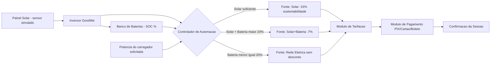

# Sprint 3 – Prototipagem Funcional e Integração
## Projeto: Totem/App de Recarga de Veículo Elétrico — GoodWe

Protótipo funcional web (HTML, CSS e JavaScript) que integra geração de energia solar, armazenamento em bateria, automação da fonte de energia e tarifação/pagamento de uma sessão de recarga de veículo elétrico.

## Equipe

Nome -------- RM 

 - Daniel Vieira : 573326 
 - Giovane Salazar : 570396 
 - Gustavo Bitencourt : 568885 
 - Leonardo Takachi : 569066 

## Histórico do projeto

- **Sprint 1** — Levantamento da solução em energias renováveis e sustentáveis (repositório: `Sprint01-SERS`).
- **Sprint 2** — Prova de conceito funcional: protótipo web da sessão de recarga com cálculo de tarifa por potência, desconto para usuário Premium, acréscimo de horário de pico e fluxo de pagamento (PIX/Cartão/Boleto).
- **Sprint 3** (esta entrega) — Prototipagem funcional e **integração**: adição do módulo de energia renovável (placa solar + bateria) e de um controlador de automação que decide, em tempo real, a fonte de energia usada em cada sessão de recarga, refletindo essa decisão na tarifação final.

## Esquema de integração dos componentes



**Fluxo de dados:** os sensores simulados de geração solar e SOC da bateria são lidos a cada 3 segundos (`simularSensores()`). Quando o usuário inicia uma sessão informando a potência do carregador, o controlador de automação (`decidirFonteEnergia()`) compara a demanda com a energia disponível e define a fonte (Solar / Solar + Bateria / Rede), que por sua vez altera o desconto aplicado no módulo de tarifação e é exibido tanto na aba Sessão quanto no resumo de Pagamento.

## Justificativa técnica das escolhas

- **Simulação de sensores em JavaScript** (em vez de hardware físico): permite demonstrar a lógica de integração e automação de forma reprodutível em qualquer navegador, sem depender de um painel solar e um BMS (Battery Management System) físicos, mantendo o protótipo 100% funcional e testável.
- **Curva de geração solar senoidal (06h–18h, pico ao meio-dia):** aproxima o comportamento real de um painel fotovoltaico ao longo do dia, permitindo observar a automação escolhendo fontes diferentes conforme o horário.
- **Regra de decisão em 3 níveis (Solar → Solar+Bateria → Rede):** reflete a lógica real de um sistema de energia híbrido — prioriza sempre a fonte renovável disponível e só recorre à rede elétrica quando a bateria está com SOC baixo (≤ 20%), preservando a reserva de energia.
- **Desconto de sustentabilidade acoplado à automação:** conecta a decisão técnica (qual fonte alimenta a recarga) a um resultado de negócio (tarifa menor), reforçando a integração entre o hardware simulado e a lógica de aplicação.
- **Marca GoodWe:** mantida da Sprint 2, pois representa fabricante real de inversores solares, dando contexto real à integração entre inversor, bateria e app de gestão de energia.

## Resultados e dados funcionais

Exemplos de execução do protótipo (sessão de 60 min, carregador de 7 kW):

| Cenário simulado | Geração Solar | SOC Bateria | Fonte decidida | Desconto sustentabilidade |
|---|---|---|---|---|
| Meio-dia, sol forte | ~8,2 kW | 85% | Solar | -15% |
| Fim de tarde, sol fraco | ~1,4 kW | 55% | Solar + Bateria | -7% |
| Noite, sem geração | 0 kW | 12% | Rede Elétrica | 0% |

O valor final da sessão é recalculado em tempo real somando: tarifa por potência (R$2,00 / R$2,50 / R$3,00 por kWh) + acréscimo de horário de pico (+30%) − desconto Premium (-20%) − desconto de sustentabilidade (0%, -7% ou -15%, conforme a automação).

## Conexão com os conteúdos da disciplina

O protótipo aplica os conceitos de **energia renovável** (geração solar simulada), **eficiência energética** (priorização da fonte mais barata/limpa disponível) e **automação inteligente** (controlador que toma decisões automáticas com base em leitura de sensores), integrando-os a um sistema de tarifação e pagamento que representa a aplicação prática desses conceitos em um produto real de recarga de veículos elétricos.

## Como rodar

1. Abra `index.html` em qualquer navegador.
2. Acompanhe a aba **⚡ Integração** para ver os sensores simulados atualizando a cada 3 segundos.
3. Na aba **🔋 Sessão**, informe tempo e potência e clique em "Iniciar Sessão" — a fonte de energia e o desconto de sustentabilidade aparecem no resultado.
4. Prossiga para **💳 Pagamento** para ver o resumo completo, incluindo a fonte de energia usada.

## Estrutura do repositório

```
├── index.html          # estrutura das abas (Sessão, Tarifação, Pagamento, Integração)
├── styles.css           # estilos, incluindo o painel de integração
├── app.js                # cálculo de tarifação + simulação de sensores + automação
├── assets/                # logo GoodWe, ícone, QR code
└── README.md              # este documento
```
